# Frontend Mentor - Space tourism website solution

This is a solution to the [Space tourism website challenge on Frontend Mentor](https://www.frontendmentor.io/challenges/space-tourism-multipage-website-gRWj1URZ3). Frontend Mentor challenges help you improve your coding skills by building realistic projects. 

## Table of contents

- [Overview](#overview)
  - [The challenge](#the-challenge)
  - [Screenshot](#screenshot)
  - [Links](#links)
- [My process](#my-process)
  - [Built with](#built-with)
  - [What I learned](#what-i-learned)
  - [Accessibility Features](#accessibility-features)
  - [Continued development](#continued-development)
  - [Useful resources](#useful-resources)
- [Author](#author)

## Overview

### The challenge

Users should be able to:

- View the optimal layout for each of the website's pages depending on their device's screen size
- See hover states for all interactive elements on the page
- View each page and be able to toggle between the tabs to see new information

### Screenshot

#### Home Screenshots

##### Desktop Home Layout

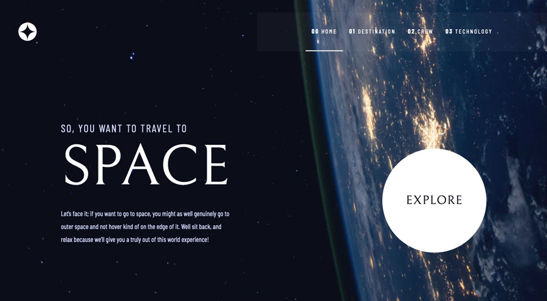

##### Tablet Home Layout

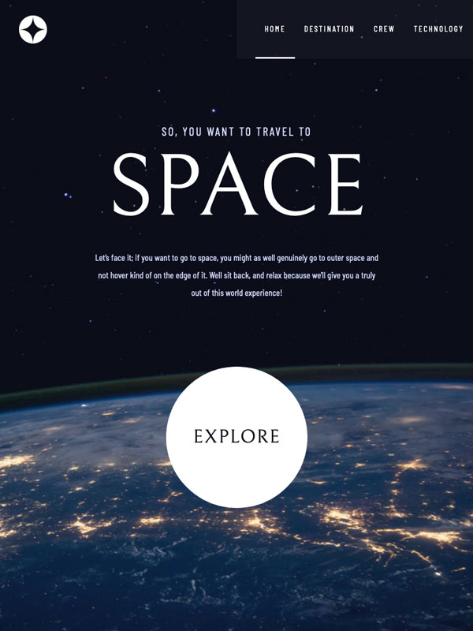

##### Mobile Home Layout

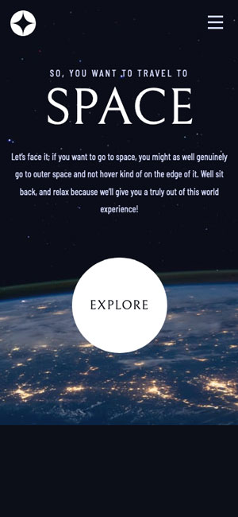

#### Destination Screenshots

##### Desktop Destination Layout

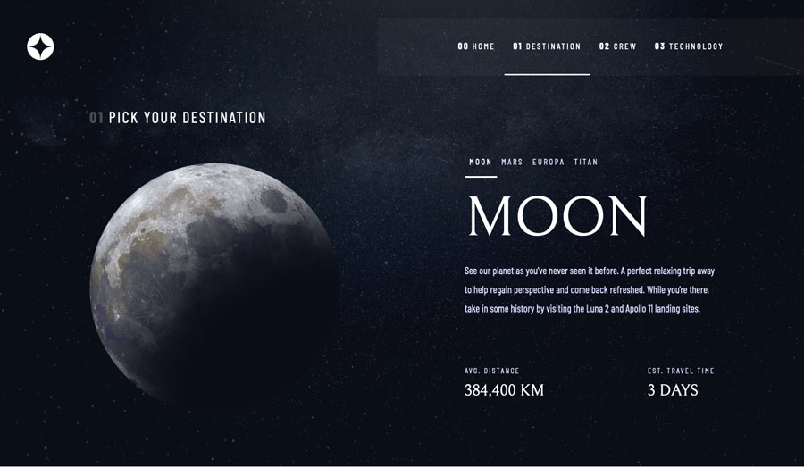

##### Tablet Destination Layout

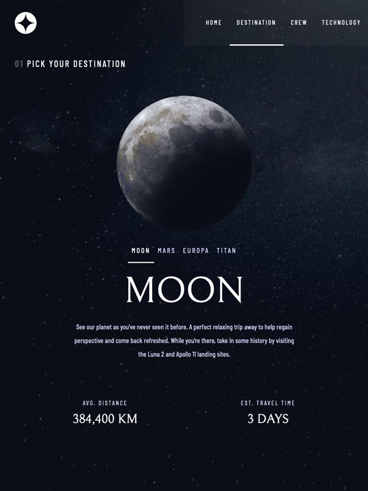

##### Mobile Destination Layout

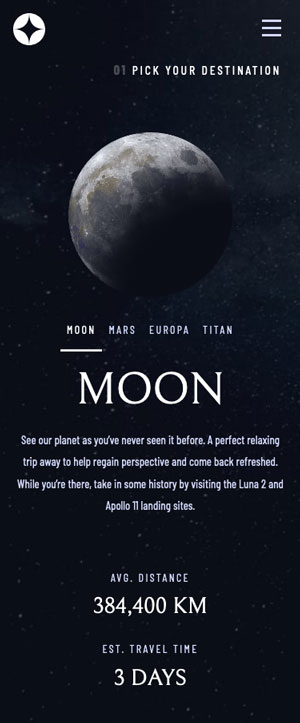

#### Crew Screenshots

##### Desktop Crew Layout

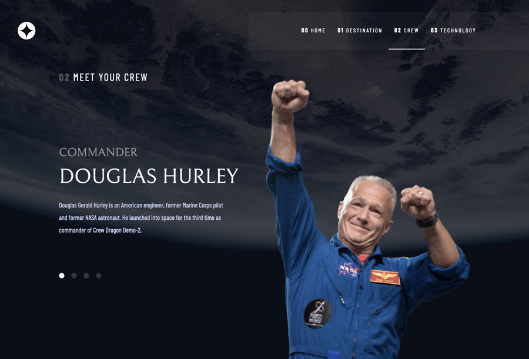

##### Tablet Crew Layout

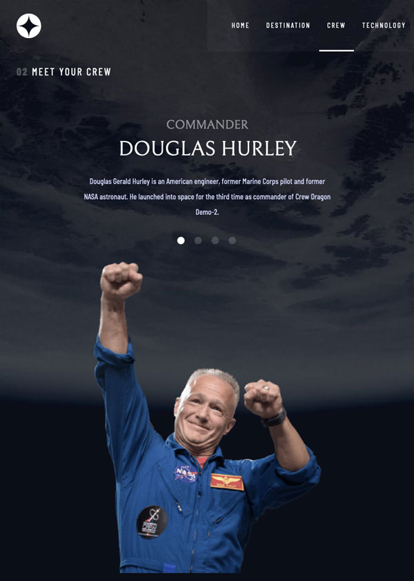

##### Mobile Crew Layout

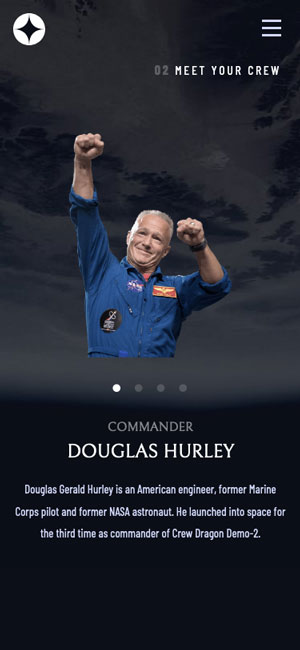

#### Technology Screenshots

##### Desktop Technology Layout

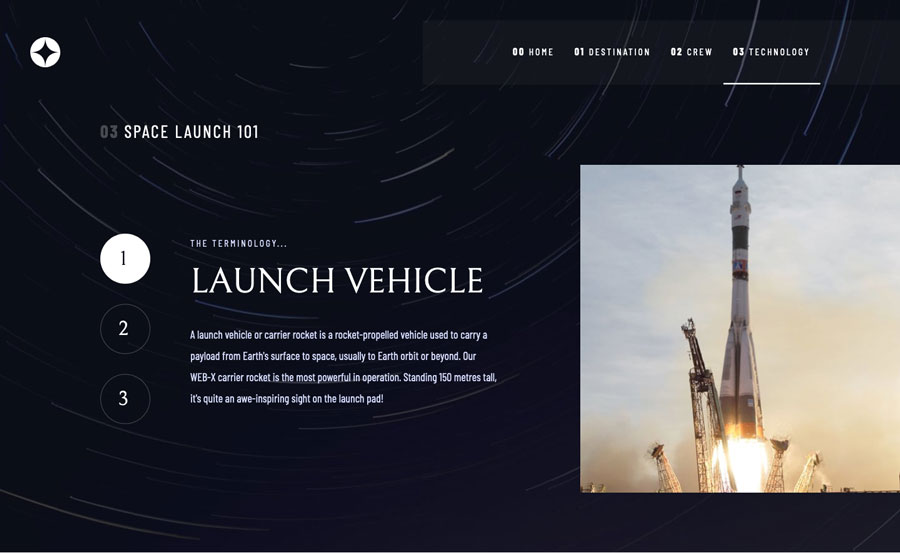

##### Tablet Technology Layout

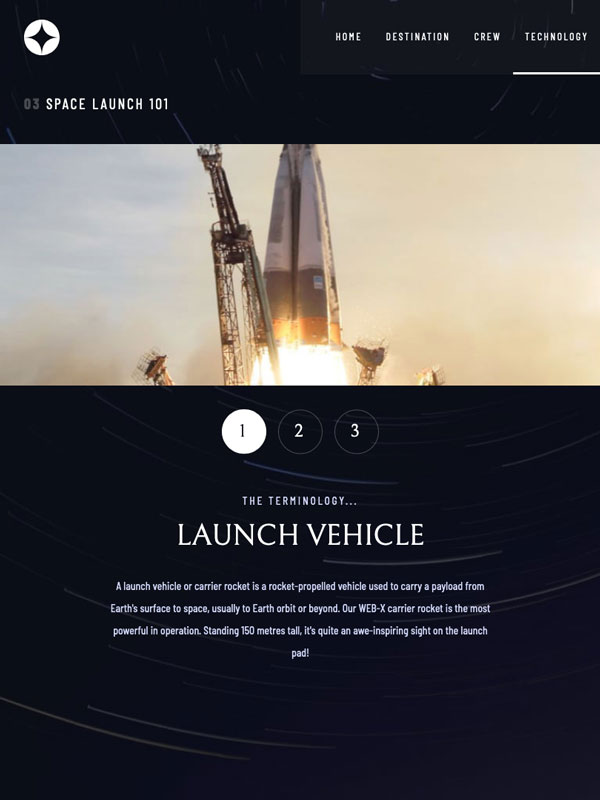

##### Mobile Technology Layout

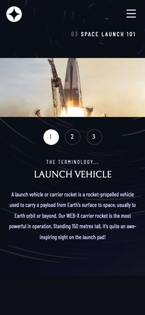

### Links

- Solution URL: [GitHub Repo](https://github.com/cessnar516/FM-Space-Tourism-Website)
- Live Site URL: [GitHub Pages](https://cessnar516.github.io/FM-Space-Tourism-Website/)

## My process

### Built with

- Semantic HTML5 markup
- SASS
- Flexbox
- Vanilla JavaScript
- Mobile-first workflow

### What I learned

It took me several tries to successfully complete this challenge. The method that worked best for me was to draw out all of the pages in their different states and make notes about their shared elements and how they changed between screen sizes. Once I had mapped these relationships out on paper, I was able to write styles that could be shared between the pages and reduce the amount of CSS needed for each specific page. I used SASS to write my styles and included all the shared styles in the base file. Then, I created a SASS file for each page and imported in the base styles at the top. 

Flexbox and nested flex containers are used throughout the site to achieve the desired layouts and media queries are used to change the designs at different viewport widths. The `flex-direction`, `align-items`, and `justify-contents` properties are adjusted at the different breakpoints to rearrange the layout without needing to adjust the HTML structure.

The `backdrop-filter: blur()` property is not supported in all browsers, so I used the CSS `@supports` rule to provide a fallback background color on the mobile navigation menu in case the blur effect is not supported. 

One new feature I learned how to use during this project was the `<picture>` element. On the Technology pages, the featured image is in landscape orientation on mobile and tablet screens, but then changes to a portrait image on desktop screens. The `<picture>` element is used to provide the browser with photo options and tell it when to display each one. For example, here is the element used on the Launch Vehicle page:

```html
<picture class="featured-image" >
  <source media="(min-width: 1200px)" srcset="assets/technology/image-launch-vehicle-portrait.jpg">
  
</picture>
```

The `` listed inside the picture element is the default photo that will be shown (in this case, the landscape image), and the `srcset` attribute is used in conjunction with a `media` attribute to display the portrait image when the screen is at least 1200 pixels wide.

### Accessibility Features

A skip to main content link is the first link on the page and the first focusable item when navigating using a keyboard. When activated, the link moves the focus down to the main content area of the page. 

JavaScript is used to toggle the mobile navigation menu. First, the script adds a class to the html element. This allow the menu elements to be targeted when JavaScript is enabled and disabled so fallbacks can be provided in the event JavaScript is not available. When JavaScript is disabled, the mobile navigation menu is displayed, and the navigation toggle button is hidden. This ensures the menu is accessible even if JavaScript isn't available. When JavaScript is enabled, the icon to toggle the menu is located inside of a `<button>` element which is given the attribute `aria-controls: primary-menu` to explain its relationship to the `<ul>` which contains the menu items. The `<ul>` is given the `aria-expanded` attribute which is set to `true` when the menu is open and `false` when the menu is closed. This provides additional context to assistive technologies to help their users understand the content. When the menu toggle button is clicked, the icon and `alt` attribute are toggled letting the user know what action the button will execute. 

The active menu item (the menu item for the page currently being viewed) is given the attribute `aria-current: page` to let assistive technologies know that the link is for the current page. Rather than disabling the link, the `href` is set to `#content` and takes the focus to the main content on that page. If the active menu item is triggered while the mobile navigation menu is open, the menu is closed.

All images on the site contain alt text. I used empty alt text for the featured images on all of the interior pages which marks them as decorative and causes screen readers to ignore them. I made this decision because the information conveyed by the images is also described in the text. 

The `aria-label` attribute is used in the secondary navigation menus on the Crew and Technology pages to provide information about where each link will take the user. While sighted users see dots or numbers, screen readers will provide the name of the page the item is linked to so they can understand where they will be taken. 

### Continued development

One area I struggled with on this project was the sizing of the featured images on the Crew pages. The pictures are all different aspect ratios, so some of the pages are longer than others, which does not match the layouts provided in the project sketch file. I will continue looking for a better solution. 

Although I am happy with the functionality of the mobile navigation menu, and I have provided a fallback for when JavaScript is not available, I feel like it cluttered up my CSS. I will continue to explore ways to reduce the CSS and achieve the same results. 

### Useful resources

- [Accessible Mobile Menu](https://www.a11ymatters.com/pattern/mobile-nav/) - I used this article to make my mobile navigation menu accessible for keyboard and screen reader users. It gives code examples and a thorough explanation. 
- [@supports Documentation](https://developer.mozilla.org/en-US/docs/Web/CSS/@supports) - This page explains how to use the `@supports` rule in your CSS to check for browser support of a property. 
- [HTML Validator](https://validator.w3.org/) - It's always a good idea to validate your HTML to check for errors, and this is a great tool you can use with a live site, uploaded file, or you can also paste your code in.
- [CSS Validator](https://jigsaw.w3.org/css-validator/) - Running your CSS through this validator is a great way to check for errors before you upload your solution.
- [Deque axe Accessibility Tester](https://www.deque.com/axe/) - The core version of this tool is available for free. It catches accessibility errors and tells you how to fix them. It also guides you through manual testing steps to check for errors the automated tool may miss. 

## Author

- LinkedIn - [Rachel Cessna](https://www.linkedin.com/in/rachelacessna/)
- Frontend Mentor - [@cessnar516](https://www.frontendmentor.io/profile/cessnar516)
- CodePen - [@cessnar](https://codepen.io/cessnar)